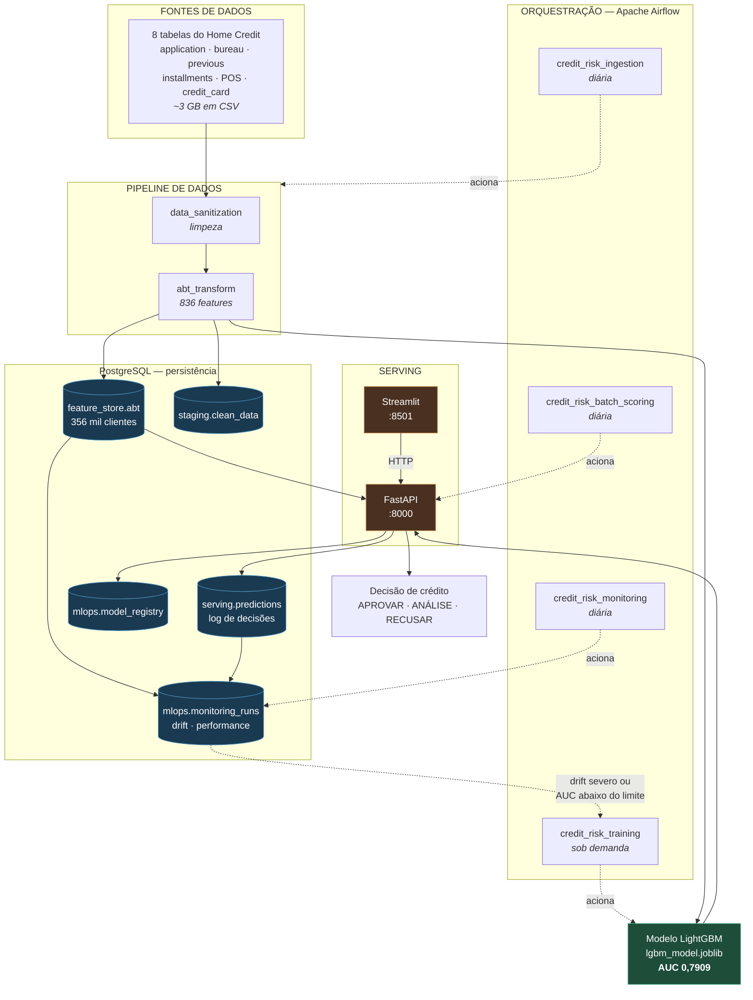
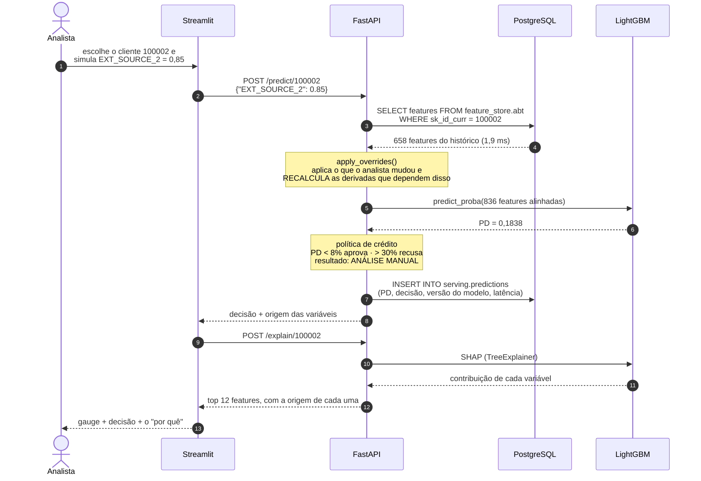

# MLOps — Arquitetura da Solução de Risco de Crédito

Este documento descreve a **arquitetura funcional completa** da solução, do dado
bruto ao deploy do modelo como serviço de predição, além da estratégia de
**monitoramento** e das **ações automatizadas** disparadas pelas previsões.

---

## 1. Arquitetura da solução

### 1.1. Componentes — o que existe e quem fala com quem



**O que ler neste diagrama:**

- O **PostgreSQL está no centro**, não na borda. Não é detalhe de
  infraestrutura: é a fonte das features na hora da decisão e o registro de tudo
  que foi decidido.
- O **painel não toca no modelo**. Ele fala HTTP com a API, como qualquer outro
  consumidor — existe um único lugar que pontua crédito.
- A seta pontilhada de volta (`monitoramento → treino`) é o **ciclo fechado**:
  quando o drift é severo ou o AUC cai abaixo do limite, o re-treino é
  recomendado. É o CRISP-DM se fechando.

---

### 1.2. Sequência — o que o código faz quando alguém pede uma decisão



**Os dois pontos que este diagrama resolve:**

1. **De onde vêm as variáveis** (passos 3–4): o analista informa 1 valor; as
   outras 657 vêm do histórico do cliente, no banco.
2. **Por que existe o recálculo** (nota após o passo 4): alterar a renda sem
   refazer a razão parcela/renda entregaria ao modelo um cliente impossível —
   renda nova com endividamento antigo.

---

### 1.3. Modelo de dados


> **Linha cheia = chave estrangeira de verdade. Linha tracejada = relação
> lógica, sem FK no banco.** A distinção é deliberada:
>
> - `predictions.model_version → model_registry` **é** FK: nenhuma decisão pode
>   ser gravada sem apontar para um modelo registrado. É o que responde, numa
>   auditoria, *"qual modelo recusou este cliente?"*.
> - `predictions.sk_id_curr → abt` **não é** FK, de propósito: o serviço precisa
>   conseguir pontuar um cliente que ainda não está na feature store (uma
>   proposta nova). Uma FK aqui rejeitaria a decisão em vez de registrá-la.
>
> O monitoramento lê `feature_store.abt` e `serving.predictions`, mas isso é
> **linhagem de dados**, não integridade referencial — por isso não aparece como
> relacionamento no diagrama.

**Duas decisões de modelagem que valem explicar:**

- **As 836 features ficam num `JSONB`, não em 836 colunas.** O Postgres
  suportaria (limite ~1600), mas cada feature nova exigiria um `ALTER TABLE` numa
  tabela de 3 GB. E a API lê o cliente inteiro de uma vez — que é exatamente o
  padrão de acesso de um feature store online.
- **As variáveis de negócio são colunas GERADAS** a partir do próprio JSONB.
  Têm tipo forte, são indexáveis e consultáveis em SQL, sem duplicar a fonte da
  verdade: são derivadas, não copiadas.

O dicionário completo — cada tabela, coluna, chave e índice — está em
[`DICIONARIO_DE_DADOS.md`](../DICIONARIO_DE_DADOS.md), **gerado** a partir do
catálogo do banco por `python -m MLOps.data_dictionary`.

---

### 1.4. Tecnologias

| Camada | Tecnologia | Onde |
|---|---|---|
| Dados / Feature engineering | Python 3.11, pandas, numpy | [`DataPipeline/`](../DataPipeline) |
| Modelo | LightGBM 4.6, scikit-learn, Optuna | [`train.py`](../Model/train.py), [`tune.py`](../Model/tune.py) |
| Explicabilidade | SHAP (TreeExplainer) | [`explain.py`](../Model/explain.py) |
| Persistência | **PostgreSQL 16** + SQLAlchemy 2 | [`sql/schema.sql`](sql/schema.sql), [`db.py`](db.py) |
| API | FastAPI + Pydantic + Uvicorn | [`app/main.py`](../app/main.py) |
| Painel | Streamlit + Plotly | [`streamlit_app.py`](../app/streamlit_app.py) |
| Orquestração | **Apache Airflow 2.10** (LocalExecutor) | [`dags/`](dags) |
| Monitoramento | PSI + AUC/KS/Gini por safra | [`monitoring.py`](monitoring.py) |
| Infraestrutura | Docker + docker-compose (6 serviços) | [`docker-compose.yml`](docker-compose.yml) |

### Componentes e responsabilidades

| Componente | Papel | Arquivo |
|---|---|---|
| **Sanitização** | Lê os CSVs brutos, limpa e padroniza | [`data_sanitization.py`](../DataPipeline/data_sanitization.py) |
| **Feature engineering** | Agrega as 8 tabelas e cria as features | [`abt_transform.py`](../DataPipeline/abt_transform.py) |
| **Tuning** | Busca de hiperparâmetros (Optuna) | [`tune.py`](../Model/tune.py) |
| **Treino** | K-Fold, avalia e persiste o modelo | [`train.py`](../Model/train.py) |
| **Carga no banco** | Publica a ABT na feature store (UPSERT) | [`load_to_db.py`](load_to_db.py) |
| **Predição** | Alinha features e traduz PD → decisão | [`predict.py`](../Model/predict.py) |
| **API** | Expõe o modelo e registra cada decisão | [`app/main.py`](../app/main.py) |
| **Painel** | Decisão e explicabilidade para o analista | [`streamlit_app.py`](../app/streamlit_app.py) |
| **Scoring em lote** | Pontua a carteira (2.000 clientes/s) | [`batch_scoring.py`](batch_scoring.py) |
| **Orquestração** | 4 DAGs + modo standalone | [`dags/`](dags), [`pipeline_orchestration.py`](pipeline_orchestration.py) |
| **Monitoramento** | Drift de dados, de predições e performance | [`monitoring.py`](monitoring.py) |
| **Dicionário de dados** | Gera a documentação a partir do banco | [`data_dictionary.py`](data_dictionary.py) |

Os artefatos do modelo (`lgbm_model.joblib`, `model_features.json`,
`model_metadata.json`) são o **contrato entre o treino e o serving**.

---

## 2. Como subir a infraestrutura (docker-compose)

Os dados são montados por **bind-mount** de `Dados/` para `/data` dentro dos
containers — basta ter os CSVs brutos em `Dados/raw_data/`.

```bash
# API de predição        →  http://localhost:8000/docs
docker compose -f MLOps/docker-compose.yml up -d --build api

# Painel Streamlit (SHAP) →  http://localhost:8501
docker compose -f MLOps/docker-compose.yml up -d --build streamlit

# Airflow (orquestração)  →  http://localhost:8081   (admin / admin)
docker compose -f MLOps/docker-compose.yml up -d --build airflow

# Pipeline sem Airflow (job único)
docker compose -f MLOps/docker-compose.yml run --rm pipeline

# Monitoramento de drift (job)
docker compose -f MLOps/docker-compose.yml run --rm monitoring

# Parar tudo
docker compose -f MLOps/docker-compose.yml down
```

### Orquestração sem Docker
```bash
python -m MLOps.pipeline_orchestration                 # pipeline completo
python -m MLOps.pipeline_orchestration --with-tuning   # incluindo tuning
```

### Se o build falhar por rede (ambiente corporativo)

Em algumas redes o host tem internet mas os **containers não** — nem o `ping` sai
(agentes de segurança que filtram o tráfego de máquinas virtuais). O `pip install`
do build quebra com timeout.

Saída: baixe os pacotes no host e construa offline.

```bash
# 1. No host (que tem internet), baixe os wheels Linux
pip download -r requirements.txt -d wheelhouse \
  --platform manylinux_2_28_x86_64 --platform manylinux2014_x86_64 \
  --python-version 3.11 --only-binary=:all:

# 2. Construa sem acessar a internet de dentro do container
docker build -f MLOps/Dockerfile.offline -t credit-risk:latest .
```

Como diagnosticar se é esse o caso:
```bash
docker run --rm busybox ping -c 2 8.8.8.8   # se falhar, o container não tem rede
```

---

## 2.1. Airflow — orquestração

O Airflow é **onde o pipeline vira rotina**. Sem ele, sanitizar, construir a
ABT, publicar no banco, pontuar a carteira e monitorar seriam comandos que
alguém precisa lembrar de rodar, na ordem certa, todo dia.

### As quatro DAGs

Vivem em [`dags/`](dags/), uma por responsabilidade:

| DAG | Grafo | Agenda |
|---|---|---|
| **`credit_risk_ingestion`** | `sanitize → build_abt → load_feature_store` | diária |
| **`credit_risk_training`** | `train → register_model` | sob demanda |
| **`credit_risk_batch_scoring`** | `batch_scoring` | diária |
| **`credit_risk_monitoring`** | `data_drift ∥ prediction_drift ∥ performance` | diária |

**Por que separadas.** Antes havia uma DAG só, com treino no meio da ingestão.
Mas re-treinar não é rotina diária: gasta horas de CPU e troca um modelo
estável por outro sem ganho comprovado. Por isso `credit_risk_training` tem
`schedule=None` — roda quando alguém decide, ou quando o monitoramento
recomenda. As outras três são rotina.

**Por que o monitoramento roda em paralelo.** A performance por safra depende
de desfechos que só amadurecem meses depois (*label lag*) e pode não ter o que
calcular. Em série, essa falta bloquearia justamente o drift — o sinal
antecipado, o único disponível no curto prazo.

### Como cada task é executada

Toda task é um **comando de terminal**, o mesmo que roda na mão:

```python
tarefa("performance", "python -m MLOps.monitoring --performance",
       ambiente=AMBIENTE_PRODUCAO)
```

Duas vantagens concretas: qualquer falha é depurável fora do Airflow, e um
import pesado (pandas, lightgbm) não acontece no processo do scheduler a cada
varredura de DAGs.

### Demo × produção, no mesmo container

O container roda por padrão em **modo demo**: amostra de 30 mil linhas e saídas
num volume isolado (`/demo`), para uma execução de demonstração jamais
sobrescrever a ABT e o modelo treinados na base completa.

Mas scoring e monitoramento precisam do modelo **real** — monitorar um modelo
de brinquedo não diz nada sobre o que está decidindo de verdade. Essas tasks
recebem o ambiente de produção explicitamente
(ver [`dags/_comum.py`](dags/_comum.py)):

```python
AMBIENTE_PRODUCAO = {"DATA_DIR": "/data", "MODEL_DIR": "/project/Model/artifacts"}
```

A carga no banco é **UPSERT**, nunca `TRUNCATE`. Isso não é detalhe: acionar a
DAG na apresentação com truncate apagaria os 356 mil clientes e deixaria só a
amostra. Verificado numa execução real — a DAG atualizou 20.532 clientes e
preservou os 335.719 restantes.

### Metastore em PostgreSQL

O Airflow guarda em banco todo o seu estado: DAGs, execuções, estado de cada
task, usuários. Com o `airflow standalone` (SQLite) esse estado morria junto
com o container, e o SQLite só admite o **SequentialExecutor** — uma task por
vez, o que transforma o grafo em leque do monitoramento numa fila.

Agora o metastore é um banco `airflow` separado, na mesma instância Postgres, e
o executor é o **LocalExecutor**. Medido numa execução real: as três tasks de
monitoramento começaram no mesmo instante (`21:34:27.07`, `.08`, `.10`).

Compartilhar a instância é uma escolha de custo, adequada a este porte. Em
produção seriam servidores distintos, para uma carga de orquestração não
disputar recursos com as consultas do serviço de predição — e o executor seria
Celery ou Kubernetes, para distribuir tasks entre máquinas.

### Como demonstrar

```bash
docker compose -f MLOps/docker-compose.yml up -d --build airflow
# UI → http://localhost:8081   (admin / admin)
```

1. Ative a DAG `credit_risk_monitoring` e clique em **Trigger**
2. Aba *Graph*: as três tasks ficam verdes **ao mesmo tempo**
3. O resultado aparece no painel, em *Monitoramento* → http://localhost:8501

Tempos reais medidos: ingestão completa em **2 min**; monitoramento em **4 s**;
scoring de 2.000 clientes em **1 s**.

> **Se o volume do Postgres foi criado antes desta versão**, os scripts de init
> não rodam de novo. Crie o banco do Airflow uma vez:
> ```bash
> docker compose -f MLOps/docker-compose.yml exec postgres >   psql -U creditrisk -d creditrisk -f /docker-entrypoint-initdb.d/00_airflow_metastore.sql
> ```

O mesmo pipeline também roda **sem Airflow**, em modo sequencial
(`python -m MLOps.pipeline_orchestration`) — útil em CI ou num cron simples.

---

## 3. Monitoramento em produção (item iii)

Um modelo de crédito degrada **sem ninguém mexer nele**, porque o mundo muda
(inflação, sazonalidade, novo público). Monitoramos três camadas:

### a) Saúde do serviço (infra)
- `/health` retorna a versão/AUC do modelo servido; usado pelo `healthcheck` do
  compose e por um orquestrador (Kubernetes) para *liveness/readiness*.
- Métricas de infra: latência p95 da API, taxa de erro HTTP, throughput.

### b) Drift de dados ([`monitoring.py`](monitoring.py))
- **PSI (Population Stability Index)** por feature, comparando produção contra o
  treino (referência): `PSI > 0.25` = drift severo.
- **Prediction drift**: acompanha a taxa média de default prevista ao longo do
  tempo. Um salto sinaliza problema mesmo **antes** de termos o label real.

### c) Performance do modelo (com *label lag*)
- No crédito, o TARGET real (inadimplência) só se materializa meses depois. Por
  isso monitoramos **proxies antecipados** (drift + prediction drift) e, quando
  os labels chegam, recalculamos AUC/KS sobre as safras já maduras.

**Gatilho de re-treino:** `monitoring_report()` devolve `retrain_recommended=True`
quando há drift severo → a DAG do Airflow (ou um cron) dispara o
`pipeline_orchestration` novamente.

---

## 4. Ações automatizadas + agentes de IA (item iv)

A previsão não é o fim — ela **aciona decisões de negócio**:

| Faixa (PD) | Decisão automática | Ação acionada |
|---|---|---|
| `< 0.08` (BAIXO) | **APROVAR** | Crédito liberado automaticamente; e-mail de boas-vindas |
| `0.08–0.30` (MODERADO/ALTO) | **ANÁLISE MANUAL** | Cria ticket para o analista com as features de maior peso (SHAP) |
| `> 0.30` (MUITO ALTO) | **RECUSAR** | Recusa automática + oferta alternativa (limite menor / garantia) |

### Agentes de IA no fluxo
- **Agente de explicação:** para casos de análise manual, um LLM recebe as
  top features (SHAP) e gera um resumo em linguagem natural do *porquê* do risco,
  acelerando a decisão do analista e apoiando a **explicabilidade regulatória**.
- **Agente de retenção:** para clientes recusados de baixo-moderado risco, propõe
  automaticamente um produto alternativo viável.
- **Agente de monitoramento:** interpreta o `drift_report.json`, resume em
  linguagem natural quais features driftaram e abre um incidente com a
  recomendação (re-treinar / investigar fonte de dados).

Todas as decisões automáticas são **logadas** (entrada, PD, decisão, versão do
modelo) para auditoria e conformidade (governança).
