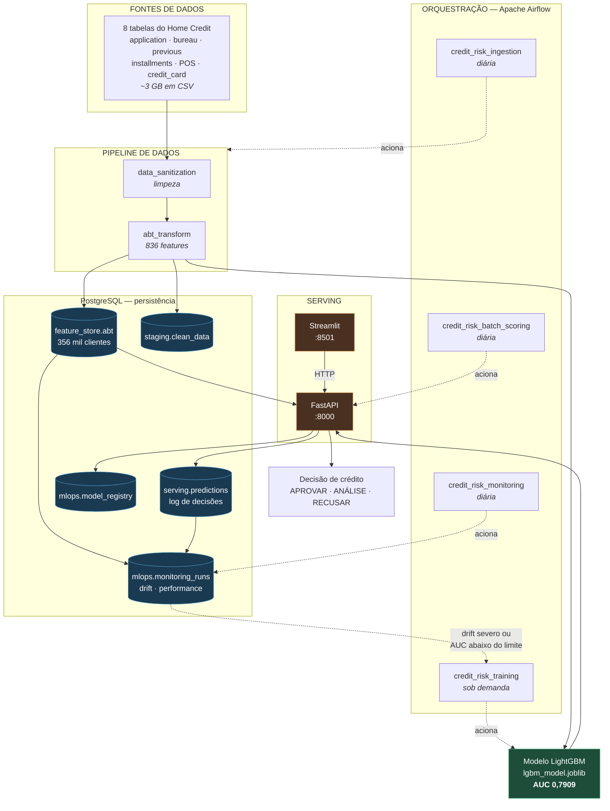
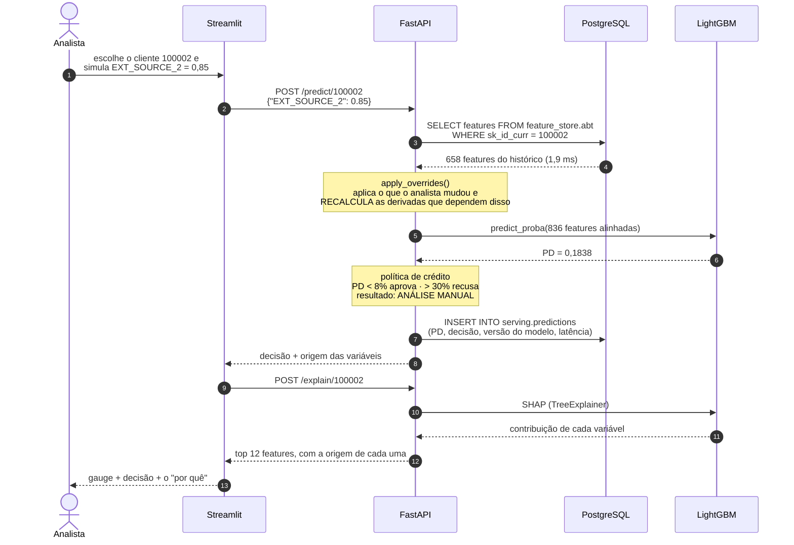
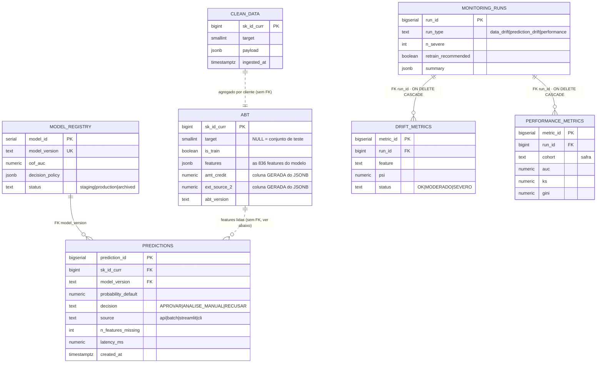

# MLOps — Arquitetura da Solução de Risco de Crédito

Este documento descreve a **arquitetura funcional completa** da solução, do dado
bruto ao deploy do modelo como serviço de predição, além da estratégia de
**monitoramento** (item iii), das **ações automatizadas** disparadas pelas
previsões (item iv) e dos **próximos passos de desenvolvimento**.

---

## 1. Arquitetura da solução

### 1.1. Componentes — o que existe e quem fala com quem



**O que ler neste diagrama:**

- O **PostgreSQL está no centro**, não na borda. Não é detalhe de
  infraestrutura: é a fonte das features na hora da decisão e o registro de tudo
  que foi decidido.
- O **painel não toca no modelo**. Ele fala HTTP com a API, como qualquer outro
  consumidor — existe um único lugar que pontua crédito.
- A seta pontilhada de volta (`monitoramento → treino`) é o **ciclo fechado**:
  quando o drift é severo ou o AUC cai abaixo do limite, o re-treino é
  recomendado. É o CRISP-DM se fechando.

---

### 1.2. Sequência — o que o código faz quando alguém pede uma decisão



**Os dois pontos que este diagrama resolve:**

1. **De onde vêm as variáveis** (passos 3–4): o analista informa 1 valor; as
   outras 657 vêm do histórico do cliente, no banco.
2. **Por que existe o recálculo** (nota após o passo 4): alterar a renda sem
   refazer a razão parcela/renda entregaria ao modelo um cliente impossível —
   renda nova com endividamento antigo.

---

### 1.3. Modelo de dados



> **Linha cheia = chave estrangeira de verdade. Linha tracejada = relação
> lógica, sem FK no banco.** A distinção é deliberada:
>
> - `predictions.model_version → model_registry` **é** FK: nenhuma decisão pode
>   ser gravada sem apontar para um modelo registrado. É o que responde, numa
>   auditoria, *"qual modelo recusou este cliente?"*.
> - `predictions.sk_id_curr → abt` **não é** FK, de propósito: o serviço precisa
>   conseguir pontuar um cliente que ainda não está na feature store (uma
>   proposta nova). Uma FK aqui rejeitaria a decisão em vez de registrá-la.
>
> O monitoramento lê `feature_store.abt` e `serving.predictions`, mas isso é
> **linhagem de dados**, não integridade referencial — por isso não aparece como
> relacionamento no diagrama.

**Duas decisões de modelagem que valem explicar:**

- **As 836 features ficam num `JSONB`, não em 836 colunas.** O Postgres
  suportaria (limite ~1600), mas cada feature nova exigiria um `ALTER TABLE` numa
  tabela de 3 GB. E a API lê o cliente inteiro de uma vez — que é exatamente o
  padrão de acesso de um feature store online.
- **As variáveis de negócio são colunas GERADAS** a partir do próprio JSONB.
  Têm tipo forte, são indexáveis e consultáveis em SQL, sem duplicar a fonte da
  verdade: são derivadas, não copiadas.

O dicionário completo — cada tabela, coluna, chave e índice — está em
[`DICIONARIO_DE_DADOS.md`](../DICIONARIO_DE_DADOS.md), **gerado** a partir do
catálogo do banco por `python -m MLOps.data_dictionary`.

---

### 1.4. Tecnologias

| Camada | Tecnologia | Onde |
|---|---|---|
| Dados / Feature engineering | Python 3.11, pandas, numpy | [`DataPipeline/`](../DataPipeline) |
| Modelo | LightGBM 4.6, scikit-learn, Optuna | [`train.py`](../Model/train.py), [`tune.py`](../Model/tune.py) |
| Explicabilidade | SHAP (TreeExplainer) | [`explain.py`](../Model/explain.py) |
| Persistência | **PostgreSQL 16** + SQLAlchemy 2 | [`sql/schema.sql`](sql/schema.sql), [`db.py`](db.py) |
| API | FastAPI + Pydantic + Uvicorn | [`app/main.py`](../app/main.py) |
| Painel | Streamlit + Plotly | [`streamlit_app.py`](../app/streamlit_app.py) |
| Orquestração | **Apache Airflow 2.10** (LocalExecutor) | [`dags/`](dags) |
| Monitoramento | PSI + AUC/KS/Gini por safra | [`monitoring.py`](monitoring.py) |
| Infraestrutura | Docker + docker-compose (6 serviços) | [`docker-compose.yml`](docker-compose.yml) |

### Componentes e responsabilidades

| Componente | Papel | Arquivo |
|---|---|---|
| **Sanitização** | Lê os CSVs brutos, limpa e padroniza | [`data_sanitization.py`](../DataPipeline/data_sanitization.py) |
| **Feature engineering** | Agrega as 8 tabelas e cria as features | [`abt_transform.py`](../DataPipeline/abt_transform.py) |
| **Tuning** | Busca de hiperparâmetros (Optuna) | [`tune.py`](../Model/tune.py) |
| **Treino** | K-Fold, avalia e persiste o modelo | [`train.py`](../Model/train.py) |
| **Carga no banco** | Publica a ABT na feature store (UPSERT) | [`load_to_db.py`](load_to_db.py) |
| **Predição** | Alinha features e traduz PD → decisão | [`predict.py`](../Model/predict.py) |
| **API** | Expõe o modelo e registra cada decisão | [`app/main.py`](../app/main.py) |
| **Painel** | Decisão e explicabilidade para o analista | [`streamlit_app.py`](../app/streamlit_app.py) |
| **Scoring em lote** | Pontua a carteira (2.000 clientes/s) | [`batch_scoring.py`](batch_scoring.py) |
| **Orquestração** | 4 DAGs + modo standalone | [`dags/`](dags), [`pipeline_orchestration.py`](pipeline_orchestration.py) |
| **Monitoramento** | Drift de dados, de predições e performance | [`monitoring.py`](monitoring.py) |
| **Dicionário de dados** | Gera a documentação a partir do banco | [`data_dictionary.py`](data_dictionary.py) |

Os artefatos do modelo (`lgbm_model.joblib`, `model_features.json`,
`model_metadata.json`) são o **contrato entre o treino e o serving**.

---

## 2. Como subir a infraestrutura (docker-compose)

Os dados são montados por **bind-mount** de `Dados/` para `/data` dentro dos
containers — basta ter os CSVs brutos em `Dados/raw_data/`.

```bash
# API de predição        →  http://localhost:8000/docs
docker compose -f MLOps/docker-compose.yml up -d --build api

# Painel Streamlit (SHAP) →  http://localhost:8501
docker compose -f MLOps/docker-compose.yml up -d --build streamlit

# Airflow (orquestração)  →  http://localhost:8081   (admin / admin)
docker compose -f MLOps/docker-compose.yml up -d --build airflow

# Pipeline sem Airflow (job único)
docker compose -f MLOps/docker-compose.yml run --rm pipeline

# Monitoramento de drift (job)
docker compose -f MLOps/docker-compose.yml run --rm monitoring

# Parar tudo
docker compose -f MLOps/docker-compose.yml down
```

### Orquestração sem Docker
```bash
python -m MLOps.pipeline_orchestration                 # pipeline completo
python -m MLOps.pipeline_orchestration --with-tuning   # incluindo tuning
```

### Se o build falhar por rede (ambiente corporativo)

Em algumas redes o host tem internet mas os **containers não** — nem o `ping` sai
(agentes de segurança que filtram o tráfego de máquinas virtuais). O `pip install`
do build quebra com timeout.

Saída: baixe os pacotes no host e construa offline.

```bash
# 1. No host (que tem internet), baixe os wheels Linux
pip download -r requirements.txt -d wheelhouse \
  --platform manylinux_2_28_x86_64 --platform manylinux2014_x86_64 \
  --python-version 3.11 --only-binary=:all:

# 2. Construa sem acessar a internet de dentro do container
docker build -f MLOps/Dockerfile.offline -t credit-risk:latest .
```

Como diagnosticar se é esse o caso:
```bash
docker run --rm busybox ping -c 2 8.8.8.8   # se falhar, o container não tem rede
```

---

## 2.1. Airflow — orquestração

O Airflow é **onde o pipeline vira rotina**. Sem ele, sanitizar, construir a
ABT, publicar no banco, pontuar a carteira e monitorar seriam comandos que
alguém precisa lembrar de rodar, na ordem certa, todo dia.

### As quatro DAGs

Vivem em [`dags/`](dags/), uma por responsabilidade:

| DAG | Grafo | Agenda |
|---|---|---|
| **`credit_risk_ingestion`** | `sanitize → build_abt → load_feature_store` | diária |
| **`credit_risk_training`** | `train → register_model` | sob demanda |
| **`credit_risk_batch_scoring`** | `batch_scoring` | diária |
| **`credit_risk_monitoring`** | `data_drift ∥ prediction_drift ∥ performance` | diária |

**Por que separadas.** Antes havia uma DAG só, com treino no meio da ingestão.
Mas re-treinar não é rotina diária: gasta horas de CPU e troca um modelo
estável por outro sem ganho comprovado. Por isso `credit_risk_training` tem
`schedule=None` — roda quando alguém decide, ou quando o monitoramento
recomenda. As outras três são rotina.

**Por que o monitoramento roda em paralelo.** A performance por safra depende
de desfechos que só amadurecem meses depois (*label lag*) e pode não ter o que
calcular. Em série, essa falta bloquearia justamente o drift — o sinal
antecipado, o único disponível no curto prazo.

### Como cada task é executada

Toda task é um **comando de terminal**, o mesmo que roda na mão:

```python
tarefa("performance", "python -m MLOps.monitoring --performance",
       ambiente=AMBIENTE_PRODUCAO)
```

Duas vantagens concretas: qualquer falha é depurável fora do Airflow, e um
import pesado (pandas, lightgbm) não acontece no processo do scheduler a cada
varredura de DAGs.

### Demo × produção, no mesmo container

O container roda por padrão em **modo demo**: amostra de 30 mil linhas e saídas
num volume isolado (`/demo`), para uma execução de demonstração jamais
sobrescrever a ABT e o modelo treinados na base completa.

Mas scoring e monitoramento precisam do modelo **real** — monitorar um modelo
de brinquedo não diz nada sobre o que está decidindo de verdade. Essas tasks
recebem o ambiente de produção explicitamente
(ver [`dags/_comum.py`](dags/_comum.py)):

```python
AMBIENTE_PRODUCAO = {"DATA_DIR": "/data", "MODEL_DIR": "/project/Model/artifacts"}
```

A carga no banco é **UPSERT**, nunca `TRUNCATE`. Isso não é detalhe: acionar a
DAG na apresentação com truncate apagaria os 356 mil clientes e deixaria só a
amostra. Verificado numa execução real — a DAG atualizou 20.532 clientes e
preservou os 335.719 restantes.

### Metastore em PostgreSQL

O Airflow guarda em banco todo o seu estado: DAGs, execuções, estado de cada
task, usuários. Com o `airflow standalone` (SQLite) esse estado morria junto
com o container, e o SQLite só admite o **SequentialExecutor** — uma task por
vez, o que transforma o grafo em leque do monitoramento numa fila.

Agora o metastore é um banco `airflow` separado, na mesma instância Postgres, e
o executor é o **LocalExecutor**. Medido numa execução real: as três tasks de
monitoramento começaram no mesmo instante (`21:34:27.07`, `.08`, `.10`).

Compartilhar a instância é uma escolha de custo, adequada a este porte. Em
produção seriam servidores distintos, para uma carga de orquestração não
disputar recursos com as consultas do serviço de predição — e o executor seria
Celery ou Kubernetes, para distribuir tasks entre máquinas.

### Como demonstrar

```bash
docker compose -f MLOps/docker-compose.yml up -d --build airflow
# UI → http://localhost:8081   (admin / admin)
```

1. Ative a DAG `credit_risk_monitoring` e clique em **Trigger**
2. Aba *Graph*: as três tasks ficam verdes **ao mesmo tempo**
3. O resultado aparece no painel, em *Monitoramento* → http://localhost:8501

Tempos reais medidos: ingestão completa em **2 min**; monitoramento em **4 s**;
scoring de 2.000 clientes em **1 s**.

> **Se o volume do Postgres foi criado antes desta versão**, os scripts de init
> não rodam de novo. Crie o banco do Airflow uma vez:
> ```bash
> docker compose -f MLOps/docker-compose.yml exec postgres >   psql -U creditrisk -d creditrisk -f /docker-entrypoint-initdb.d/00_airflow_metastore.sql
> ```

O mesmo pipeline também roda **sem Airflow**, em modo sequencial
(`python -m MLOps.pipeline_orchestration`) — útil em CI ou num cron simples.

---

## 3. Monitoramento em produção (item iii)

Um modelo de crédito degrada **sem ninguém mexer nele**, porque o mundo muda
(inflação, sazonalidade, novo público). Monitoramos três camadas:

### a) Saúde do serviço (infra)
- `/health` retorna a versão/AUC do modelo servido; usado pelo `healthcheck` do
  compose e por um orquestrador (Kubernetes) para *liveness/readiness*.
- Métricas de infra: latência p95 da API, taxa de erro HTTP, throughput.

### b) Drift de dados ([`monitoring.py`](monitoring.py))
- **PSI (Population Stability Index)** por feature, comparando produção contra o
  treino (referência): `PSI > 0.25` = drift severo.
- **Prediction drift**: acompanha a taxa média de default prevista ao longo do
  tempo. Um salto sinaliza problema mesmo **antes** de termos o label real.

### c) Performance do modelo (com *label lag*)
- No crédito, o TARGET real (inadimplência) só se materializa meses depois. Por
  isso monitoramos **proxies antecipados** (drift + prediction drift) e, quando
  os labels chegam, recalculamos AUC/KS sobre as safras já maduras.

**Gatilho de re-treino:** `monitoring_report()` devolve `retrain_recommended=True`
quando há drift severo → a DAG do Airflow (ou um cron) dispara o
`pipeline_orchestration` novamente.

---

## 4. Ações automatizadas + agentes de IA (item iv)

> **Esta seção é uma proposta**, não um componente implementado. O enunciado
> pede para *propor* as ações que poderiam ser acionadas a partir das previsões;
> o que está em produção neste repositório é tudo que vem antes: a decisão, o
> registro dela e o monitoramento. O que segue é o desenho de como essa decisão
> viraria ação, e o que já existe no código para sustentá-lo.

### 4.1. O problema que a automação resolve

Hoje a solução entrega uma decisão: `APROVAR`, `ANALISE_MANUAL` ou `RECUSAR`.
Entre essa decisão e o efeito no negócio ainda há uma pessoa: alguém lê a tela,
abre outro sistema, libera o crédito ou escreve para o cliente.

Esse intervalo custa de três formas. **Tempo:** uma aprovação de baixo risco que
espera dois dias na fila é uma venda que o concorrente fecha antes. **Consistência:**
dois analistas diante do mesmo `ANALISE_MANUAL` decidem diferente, e a política
vira folclore. **Receita silenciosa:** cerca de 3% dos pedidos são recusados
automaticamente, e ninguém pergunta se aquele cliente caberia num valor menor.

### 4.2. As ações propostas, por faixa de decisão

| Faixa (PD) | Decisão | Ações automatizadas propostas |
|---|---|---|
| `< 8%` | **APROVAR** | Liberar o crédito no sistema de originação · notificar o cliente · registrar a decisão com a versão do modelo |
| `8% – 30%` | **ANÁLISE MANUAL** | Abrir ticket para a mesa de crédito **já com a explicação SHAP anexada** · priorizar a fila por valor e por proximidade do corte · anexar o histórico do cliente |
| `> 30%` | **RECUSAR** | Antes de comunicar: procurar uma **oferta alternativa viável** · se não houver, registrar a recusa com a justificativa · alimentar a régua de reanálise futura |

A ação mais valiosa é a da faixa de recusa, e ela merece detalhe.

### 4.3. A ação com maior retorno: oferta alternativa

A recusa quase nunca é sobre a **pessoa** — é sobre o **valor pedido**. O mesmo
cliente, pedindo menos, frequentemente cabe na política.

Isso é uma **busca sobre o modelo**, não uma regra fixa: varia o valor do
crédito (com a parcela ajustada na mesma proporção, senão a proposta não existe
no mundo real), reavalia o cliente a cada passo e encontra o maior valor cuja PD
ainda fica abaixo do corte de aprovação. Uma busca binária resolve em ~12
iterações.

O projeto **já tem as duas peças necessárias** para isso:

- `Model.predict.apply_overrides()` altera variáveis e **recalcula as 9 features
  derivadas** afetadas — é o que garante que o cliente simulado seja coerente;
- `POST /predict/{id}` já aceita exatamente esse tipo de simulação, e o painel
  já demonstra a PD mudando quando o valor muda.

Falta apenas o laço de busca e o disparo da oferta. **É deliberadamente o que
não foi implementado:** o enunciado pede a proposta, e implementar a ação sem
um sistema de originação real para receber a oferta produziria uma tabela de
"ofertas simuladas" que ninguém consome.

### 4.4. Onde entrariam os agentes de IA

Três agentes, cada um resolvendo uma pergunta que um número sozinho não responde.

**Agente de explicação — "por que este cliente foi recusado?"**
Recebe as contribuições SHAP que a API **já calcula** (`POST /explain/{id}`) e
escreve a justificativa em linguagem de negócio: *"o que mais pesou contra foram
os scores de bureau externo e o comprometimento da renda com a parcela; a favor,
o tempo de emprego"*. Serve ao analista, ao atendimento e à exigência
regulatória de justificar a recusa. É o caso de uso mais direto de um LLM aqui,
porque o trabalho é de **redação**: os fatos já estão apurados.

**Agente de retenção — "existe crédito que este cliente conseguiria pagar?"**
Interpreta o resultado da busca da seção 4.3 e redige a contraproposta. A
inteligência dura está na busca sobre o modelo; o agente traduz o número em
oferta comunicável.

**Agente de monitoramento — "o que está acontecendo, e o que eu faço?"**
Lê `mlops.monitoring_runs` e transforma a tabela de PSI e AUC no parágrafo que
alguém de plantão precisa às 3h da manhã: o que mudou, quão grave é, e qual a
próxima ação. Hoje o monitoramento produz o dado certo — *6 variáveis com drift
severo, safra com AUC 0,713 abaixo do limite de 0,751* — mas quem recebe isso
precisa saber ler PSI. O agente fecha essa distância.

### 4.5. Onde essa proposta pode dar errado

Três coisas me preocupam nela, e prefiro dizer antes que perguntem.

**A primeira é que LLM erra, e crédito é uma atividade regulada.** Por isso o
agente escreve, mas não decide. Quem decide continua sendo o modelo e a política
de corte; o agente só transforma os valores SHAP em uma frase que uma pessoa
entende. Se ele escrever algo torto, a decisão que vale é a que está gravada em
`serving.predictions`, não a redação. Ainda assim, um texto que vai para o
cliente precisa de revisão por amostragem.

**A segunda é a dependência de um serviço externo bem no meio da operação.**
Colocar uma chamada de LLM dentro do fluxo de decisão significa herdar a
latência dele e o dia em que ele estiver fora do ar. Não vale a pena: a decisão
sai na hora, como já sai hoje, e o texto chega depois. Assíncrono resolve.

**A terceira é o custo.** Gerar texto para toda decisão é caro sem motivo. As
aprovações de baixo risco não precisam de redação nenhuma — ninguém pede
explicação quando o crédito é liberado. Vale a pena escrever nos casos que
alguém vai ler: a faixa de análise manual e as recusas.

### 4.6. O que já existe para sustentar tudo isso

A proposta não parte do zero. As fundações estão implementadas e testadas:

| Fundação | Onde | Estado |
|---|---|---|
| Decisão traduzida em faixa de negócio | [`Model/predict.py`](../Model/predict.py) | ✅ |
| Explicação individual (SHAP) exposta por API | [`app/main.py`](../app/main.py) · `POST /explain/{id}` | ✅ |
| Simulação coerente (recalcula derivadas) | `Model.predict.apply_overrides()` | ✅ |
| Log auditável de toda decisão | `serving.predictions` | ✅ |
| Rastreabilidade do modelo que decidiu | `mlops.model_registry` (FK) | ✅ |
| Sinal de monitoramento estruturado | `mlops.monitoring_runs` | ✅ |
| Agendamento para rodar as ações | Airflow, [`dags/`](dags) | ✅ |
| **Motor de ações e agentes** | — | **proposta** |

Toda decisão automática já é registrada com entrada, PD, decisão, versão do
modelo e latência. Governança e auditoria não são um passo futuro: são a base
sobre a qual a automação poderia ser ligada com segurança.

---

## 5. Próximos passos de desenvolvimento

O que ficou de fora, e por quê. Está em ordem de prioridade, não de esforço.

### 5.1. O motor de ações (item iv)

É o passo mais perto do negócio, e a seção 4 inteira existe para descrevê-lo.
Ficou como proposta de propósito: sem um sistema de originação de verdade para
receber a oferta, o motor gravaria decisões numa tabela que ninguém lê.

### 5.2. Re-treino disparado pelo monitoramento

A DAG `credit_risk_training` está pausada e só roda no braço. Isso é escolha,
não esquecimento: trocar o modelo que decide crédito é decisão de negócio, não
de agendador.

O sinal para re-treinar já existe — o monitoramento grava
`retrain_recommended` em `mlops.monitoring_runs`. O que falta é o caminho entre
o sinal e a troca, com uma pessoa no meio: o alerta chega, alguém olha, e só
então a nova versão é promovida no registry.

### 5.3. Treino que reproduz igual

O pipeline de dados reproduz bit a bit. Se você reconstruir a ABT do zero, o
arquivo sai com o mesmo SHA-256 do que está em produção. Testei.

O treino não. Com `n_jobs=-1`, o LightGBM monta os histogramas em paralelo e o
early stopping para num ponto ligeiramente diferente a cada execução: o mesmo
comando gerou 2.319 árvores numa vez e 2.366 na outra, com AUC 0,790922 contra
0,790986.

Para a decisão isso não muda nada, a diferença está na quinta casa. Mas atrapalha
auditoria, porque não dá para provar que o arquivo em produção nasceu daquele
commit exato. Fixar `n_jobs=1` no treino final resolve, e custa tempo de máquina.

### 5.4. Pontuar quem ainda não está no banco

A API responde em milissegundos porque lê as 836 features prontas, por chave
primária. Ela não calcula nada na hora — e é justamente aí que aparece o limite:
um cliente que ainda não entrou na feature store não pode ser pontuado até a
próxima carga.

Para resolver, faltaria uma camada que agregue o histórico bruto sob demanda
nesses casos, mantendo a leitura direta como caminho rápido para quem já existe.

### 5.5. Registry guardando também os dados

`mlops.model_registry` responde qual modelo está no ar, desde quando e com que
métricas. Dá para rastrear qualquer decisão até o modelo que a tomou.

O que ele não guarda é sobre quais dados cada versão aprendeu. Versionar o
recorte junto do modelo (com MLflow ou coisa parecida) permitiria responder
"que população treinou este modelo?" sem depender da memória de alguém.

### 5.6. Testes de dados e de modelo

Existe uma trava na ingestão: a DAG recusa publicar uma ABT construída sobre
amostra, porque isso apagaria o histórico de quem já está no banco. Ela salvou o
projeto uma vez. Mas é uma trava específica, não uma suíte de testes.

Faltam duas coisas. Contratos de dados rodando antes da carga — schema, faixas
esperadas, taxa de nulos por coluna. E um teste que impeça a promoção de um
modelo com AUC abaixo do piso: hoje esse piso existe só no monitoramento, ou
seja, depois que o modelo já está decidindo.

### 5.7. Testar a versão nova antes de promover

Nenhuma versão nova é comparada com a atual antes de assumir. O caminho conhecido
para isso é o *shadow deployment*: a candidata pontua o mesmo tráfego em
paralelo, sem decidir nada, e as duas séries são comparadas depois.

A parte chata já está pronta, aliás. `serving.predictions` guarda a versão do
modelo em cada linha, então a tabela aguenta as duas convivendo sem confusão.
